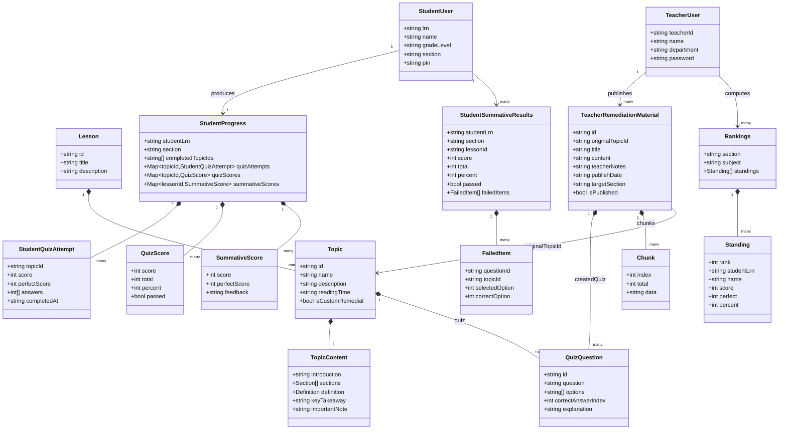
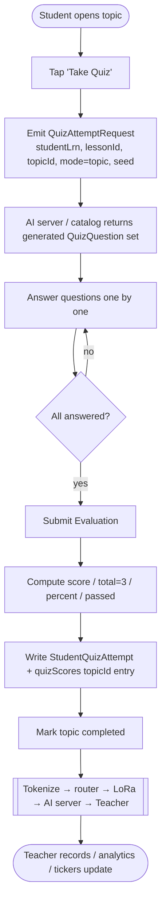
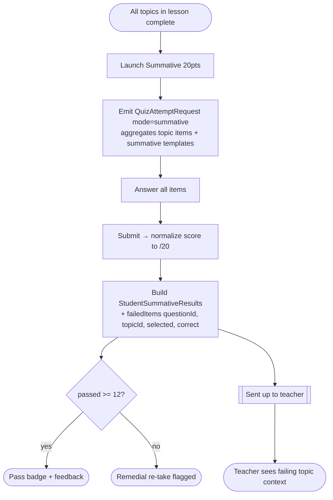
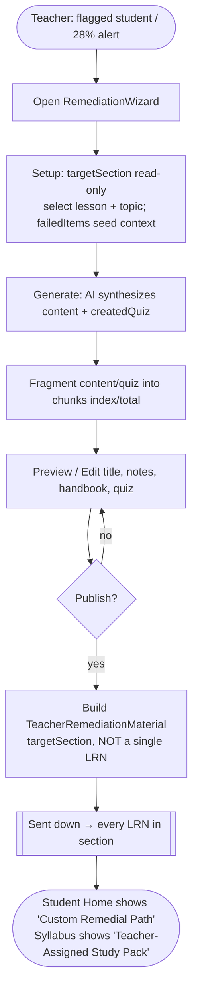

# Wave — Data Architecture, Payloads & Schemas

> Companion to [`USER_FLOWS.md`](../USER_FLOWS.md). This document inventories **every payload** relayed over the
> `app → router → LoRa → AI server → teacher` (and reverse) path, gives **class diagrams**, **activity diagrams**,
> and **data schemas**, and defines the **JSON key templates** used to *generate* quiz/summative items.
> All field names map 1:1 to the front-end models in [`src/types.ts`](../src/types.ts) and the seed data in
> [`src/data.ts`](../src/data.ts), so anything serialized here can be re-hydrated directly into the UI.

---

## Table of Contents

1. [Payload Inventory (what is sent over the wire)](#1-payload-inventory)
2. [Class Diagram](#2-class-diagram)
3. [Activity Diagrams](#3-activity-diagrams)
4. [Data Schemas (JSON Schema)](#4-data-schemas)
5. [Quiz-Attempt Generation Keys](#5-quiz-attempt-generation-keys)
6. [Field Mapping — JSON/DB ↔ Frontend](#6-field-mapping--jsondb--frontend)

---

## 1. Payload Inventory

Each payload carries a small **envelope** so the router/LoRa layer can route, chunk, and reassemble it.

### 1.0 Common Envelope

```jsonc
{
  "msgId": "uuid-v4",            // dedupe + ACK key
  "type": "StudentSignup | TeacherSignup | StudentProgress | StudentSummativeResults | Rankings | TeacherRemediationMaterial | QuizAttemptRequest | LessonCatalog",
  "direction": "up | down",      // up = student→teacher, down = teacher→student
  "subject": "science | mathematics | english",
  "section": "Grade 6 - Section Newton",
  "createdAt": "2026-06-07T08:00:00Z",
  "chunk": { "index": 0, "total": 1 }, // LoRa fragmentation; total=1 when unfragmented
  "payload": { /* one of the bodies below */ }
}
```

### 1.1 ↑ Student → Teacher (`direction: "up"`)

| # | `type` | Body keys | Source in app |
|---|--------|-----------|---------------|
| 1 | `StudentSignup` | `lrn, name, gradeLevel, section, pin` | `LoginScreen` enroll / `handleEnrollStudent` |
| 2 | `StudentProgress` | `studentLrn, section, completedTopicIds[], quizAttempts{}, quizScores{}, summativeScores{}` | `handleSaveQuizScore` |
| 3 | `StudentSummativeResults` | `studentLrn, section, lessonId, score, total, percent, passed, failedItems[]` | `handleSaveSummativeScore` |
| 4 | `QuizAttemptRequest` | `studentLrn, lessonId, topicId, mode, seed` | quiz/summative launch (triggers item generation) |

- **`quizScores`** is keyed by `topicId`: `{ score, total, percent, passed }` — the per-topic quiz outcome "sent up".
- **`failedItems[]`** is the remediation driver: `{ questionId, topicId, selectedOption, correctOption }`.

### 1.2 ↓ Teacher → Student (`direction: "down"`)

| # | `type` | Body keys | Source in app |
|---|--------|-----------|---------------|
| 5 | `TeacherSignup` | `teacherId, name, department, password` | `LoginScreen` teacher login |
| 6 | `Rankings` | `section, subject, standings[]` | computed teacher-side, pushed to `StudentRankings` |
| 7 | `TeacherRemediationMaterial` | `id, originalTopicId, title, content, teacherNotes, createdQuiz[], publishDate, targetSection, chunks[], isPublished` | `RemediationWizard` / Custom AI Lesson Wizard |

- **`targetSection`** — remedial lessons/quizzes are **always addressed to a whole section**, never a single LRN.
- **`chunks[]`** — fragments of `content`/`createdQuiz` sized to a LoRa frame, reassembled on device.
- **`standings[]`** rows: `{ rank, studentLrn, name, score, perfect, percent }`.

### 1.3 ⇄ Shared Catalog (`type: "LessonCatalog"`)

`Lesson[] → Topic[] → { content, quiz: QuizQuestion[] }` — the read content + per-topic quizzes seeded by subject.

---

## 2. Class Diagram



---

## 3. Activity Diagrams

### 3a. Student quiz attempt → score "sent up"



### 3b. Summative attempt → failed items drive remediation



### 3c. Teacher generates remedial → broadcast to section (down)



---

## 4. Data Schemas

Authoritative JSON Schemas live alongside this file:

| Schema file | Describes |
|-------------|-----------|
| [`schemas/envelope.schema.json`](schemas/envelope.schema.json) | Sync envelope wrapping every payload |
| [`schemas/student_signup.schema.json`](schemas/student_signup.schema.json) | `StudentSignup` |
| [`schemas/teacher_signup.schema.json`](schemas/teacher_signup.schema.json) | `TeacherSignup` |
| [`schemas/student_progress.schema.json`](schemas/student_progress.schema.json) | `StudentProgress` incl. `quizScores` |
| [`schemas/student_summative_results.schema.json`](schemas/student_summative_results.schema.json) | `StudentSummativeResults` incl. `failedItems` |
| [`schemas/rankings.schema.json`](schemas/rankings.schema.json) | `Rankings` |
| [`schemas/teacher_remediation_material.schema.json`](schemas/teacher_remediation_material.schema.json) | `TeacherRemediationMaterial` (section-targeted, chunked) |
| [`schemas/lesson_catalog.schema.json`](schemas/lesson_catalog.schema.json) | `Lesson` / `Topic` / `QuizQuestion` |
| [`schemas/quiz_attempt_request.payload.json`](schemas/quiz_attempt_request.payload.json) | Quiz-attempt trigger keys (sample + notes) |
| [`schemas/quiz_generation_templates.json`](schemas/quiz_generation_templates.json) | Question + summative item generation templates & variables |

---

## 5. Quiz-Attempt Generation Keys

When a student starts a quiz or summative, the app emits a **`QuizAttemptRequest`** that triggers a fresh
set of items. The full key catalog (lesson id, topic id, titles, quizzes-per-topic, summative test config,
question templates, multiple-choice option banks, and the **variables** that vary item generation) is defined in:

- [`schemas/quiz_attempt_request.payload.json`](schemas/quiz_attempt_request.payload.json)
- [`schemas/quiz_generation_templates.json`](schemas/quiz_generation_templates.json)

See §6 below for how every generated key lands on a specific UI element.

---

## 6. Field Mapping — JSON/DB ↔ Frontend

Confirms every persisted field reaches a rendered element (component + element id from `USER_FLOWS.md`).

| JSON/DB field | Model | Frontend element |
|---------------|-------|------------------|
| `lrn` | StudentUser | `#student-lrn`, profile "Verified LRN", records table |
| `name` | StudentUser/TeacherUser | header name, podium rows, table rows |
| `gradeLevel` / `section` | StudentUser | header badge, `StudentRankings` scope, teacher section filter |
| `pin` | StudentUser | `#student-pin` (login validation) |
| `teacherId`, `department` | TeacherUser | `TeacherProfile`, header `SUBJECT * GRADE - SECTION` |
| `lesson.id` / `title` / `description` | Lesson | `#lesson-{id}-container` accordion |
| `topic.id` / `name` / `readingTime` | Topic | `#topic-card-{id}`, reading badge |
| `content.introduction/sections/definition/keyTakeaway/importantNote` | TopicContent | reading view (`viewState='reading'`) |
| `quiz[].question/options/correctAnswerIndex/explanation` | QuizQuestion | `#option-{q}-{opt}`, results explanations |
| `quizAttempts[topicId].score/answers/completedAt` | StudentQuizAttempt | deep profile "Topic Assessment Results" |
| `quizScores[topicId].score/total/percent/passed` | StudentProgress | topic quiz-score box, Class Records quiz avg |
| `summativeScores[lessonId].score/perfectScore/feedback` | SummativeScore | summative chip, summative outcome view |
| `summative.failedItems[]` | StudentSummativeResults | RemediationWizard auto-diagnostic note |
| `rankings.standings[]` | Rankings | `#section-rank-{n}`, top-3 podium, "You" badge |
| `remedial.targetSection` | TeacherRemediationMaterial | "broadcasts to section" warning + study pack |
| `remedial.chunks[]` | TeacherRemediationMaterial | reassembled on device before render |
| `remedial.content/teacherNotes/createdQuiz` | TeacherRemediationMaterial | Home alert, "Teacher-Assigned Study Pack" |
</content>
