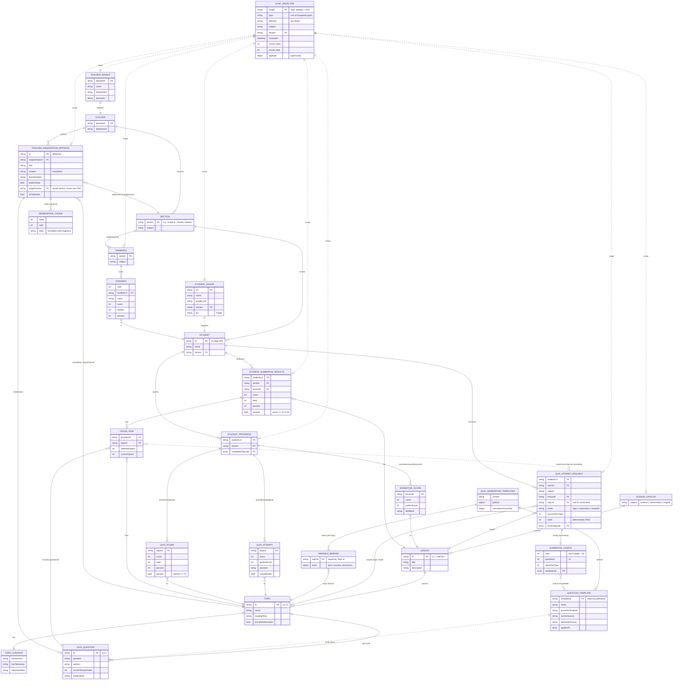

# Wave — Schema ERD

Entity-Relationship Diagram derived from the JSON Schemas in `docs/schemas/`.
The system relays **tokenized payloads** over `app → router → LoRa → AI server` (and back).
Every typed body is wrapped in a `SyncEnvelope`.

Logical hubs (not their own schema files, but the keys everything joins on):

- **Student** — identified by `lrn` / `studentLrn` (12-digit LRN)
- **Teacher** — identified by `teacherId`
- **Section** — free-text key, e.g. `"Grade 6 - Section Newton"`

`direction`: **up** = student → teacher, **down** = teacher → student.

## Relationship notes

| Join key | Connects |
|----------|----------|
| `lrn` / `studentLrn` | `Student` ↔ Signup, Progress, SummativeResults, Standing, QuizAttemptRequest |
| `section` | `Section` ↔ Signup, Envelope, Progress, Rankings, RemediationMaterial (`targetSection`) |
| `teacherId` | `Teacher` ↔ TeacherSignup, RemediationMaterial (author) |
| `lessonId` | `Lesson` ↔ QuizAttemptRequest, SummativeScore, SummativeResults |
| `topicId` | `Topic` ↔ QuizAttemptRequest, QuizAttempt, QuizScore, FailedItem, VariableBinding, RemediationMaterial (`originalTopicId`) |
| `templateId` | `QuestionTemplate` ↔ SummativeConfig (`templateIds`) |
| `questionId` | `QuizQuestion` ↔ FailedItem |
| `msgId` | `SyncEnvelope` dedupe / ACK key |
| `seed` | Makes `QuizAttemptRequest` → template generation deterministic/offline-reproducible |

## Key flows

1. **Signup** — `StudentSignup` (up) / `TeacherSignup` (down) create the Student/Teacher identities.
2. **Learn** — `LessonCatalog` (down) delivers `Lesson → Topic → QuizQuestion` content.
3. **Quiz** — `QuizAttemptRequest` (up) triggers item generation via `QuizGenerationTemplates`
   (`QuestionTemplate` + per-topic `VariableBinding`, deterministic by `seed`).
4. **Report** — `StudentProgress` & `StudentSummativeResults` (up) carry scores; `failedItems`
   feed `focusTopicIds` for **remedial** requests.
5. **React** — Teacher pushes `Rankings` and `TeacherRemediationMaterial` (down),
   the latter fragmented into `REMEDIATION_CHUNK`s for LoRa transport.
