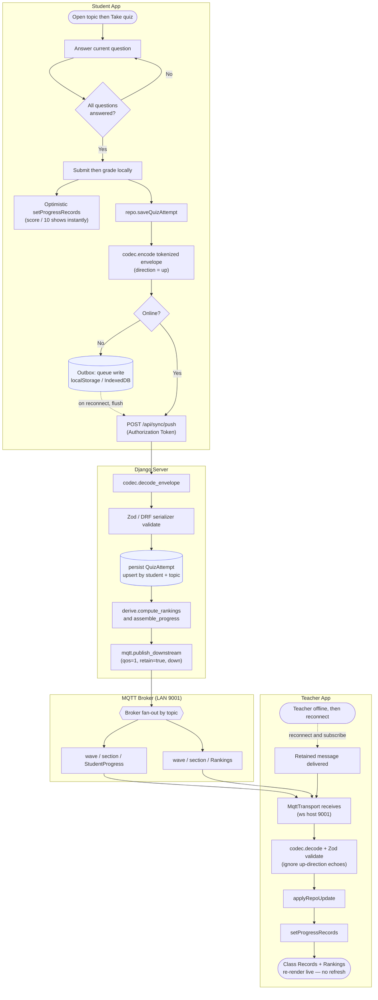

# Wave — Activity Diagram (live quiz-sync loop)

The signature end-to-end flow: a student submits a quiz and the teacher's Class Records update
**live, with no refresh**, over the internet-free LAN (the same path LoRa will later carry). Lanes
are shown as subgraphs. Reflects [App.tsx](../Wave/src/App.tsx),
[httpRepository.ts](../Wave/src/repo/httpRepository.ts), [sync/](../Wave/src/sync/),
[views.py](../server/wave_api/views.py), [ingest.py](../server/wave_api/ingest.py),
[derive.py](../server/wave_api/derive.py), [mqtt.py](../server/wave_api/mqtt.py).

### Notes
- **Per-question gating** (`C`): `Next`/`Submit` are disabled until the current question is answered,
  so a quiz can never be submitted incomplete.
- **Optimistic + sync** (`E`/`F`): the student sees the score immediately; the server is the system of
  record and re-broadcasts the *full* assembled progress, so all clients converge.
- **Offline-first** (`H`/`I`): writes queue in the Outbox and flush on reconnect; the down-channel uses
  **retained QoS-1** messages, so a teacher who was offline (`W`/`X`) gets the latest on reconnect —
  the "delivered when reachable" guarantee.
- **Secondary path (not drawn):** a teacher `publishRemediation` → `POST /api/sync/push` → server
  persists + `publish_downstream` → `wave/<section>/TeacherRemediationMaterial` → students in the
  section receive the pack live.
- `run_mqtt` is optional for this loop — the Django **web process** publishes the down-cast on the
  REST write; `run_mqtt` only handles devices that publish *up* over MQTT.
