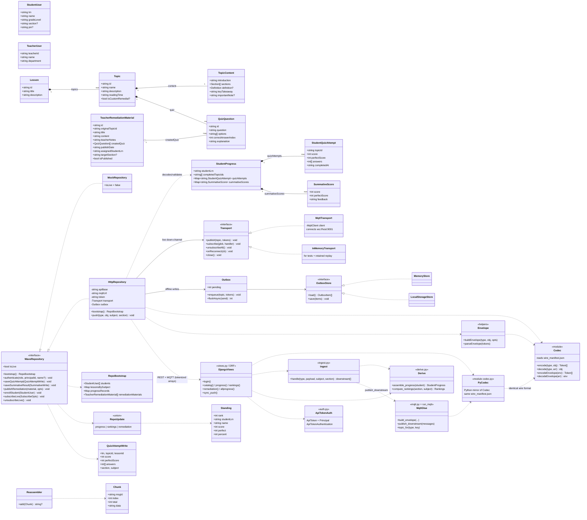

# Wave — Class Diagram

Full-stack, layered view of the domain model, the frontend data-access seam, the sync/protocol
layer, and the Django backend services. Reflects [Wave/src/types.ts](../Wave/src/types.ts),
[Wave/src/repo/](../Wave/src/repo/), [Wave/src/sync/](../Wave/src/sync/),
[protocol/wire_manifest.json](../protocol/wire_manifest.json), and
[server/wave_api/](../server/wave_api/).

### Legend
- `*--` composition, `o--` aggregation, `<|..` interface realization, `..>` dependency/uses.
- `<<module>>` = a TS/Python module of functions (not a class), shown for architectural completeness.
- The **frontend `Codec`** and the **backend `PyCodec`** read the *same* `protocol/wire_manifest.json`,
  which is why the app and server decode identical tokenized arrays over MQTT/LoRa.
