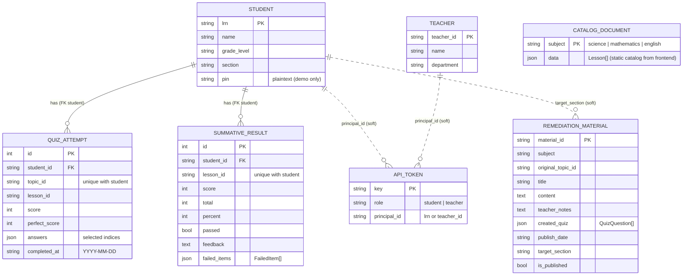

# Wave — ER Diagram (Django relational DB)

The backend database. Reflects [server/wave_api/models.py](../server/wave_api/models.py). Solid
lines are real Django ForeignKeys; **dashed** lines are *soft* references (logical links Django does
not enforce with an FK).

### Notes
- **`CATALOG_DOCUMENT`** is standalone (no relationships): the entire lessons/topics/quizzes tree is
  stored as one JSON document per subject (`data` = `Lesson[]`, 10 questions/topic), seeded from the
  frontend's `data.ts`. It is read-only and relayed whole.
- **JSON-valued columns:** `QUIZ_ATTEMPT.answers`, `SUMMATIVE_RESULT.failed_items`,
  `REMEDIATION_MATERIAL.created_quiz`, `CATALOG_DOCUMENT.data`.
- **Uniqueness:** `QUIZ_ATTEMPT` is unique per `(student, topic_id)`; `SUMMATIVE_RESULT` is unique per
  `(student, lesson_id)` — so re-submitting upserts the latest.
- **Derived, NOT stored** (computed in [derive.py](../server/wave_api/derive.py)):
  `quizScores` (per-topic %), `completedTopicIds`, and section **`Rankings`** — all assembled from
  `QUIZ_ATTEMPT` / `SUMMATIVE_RESULT` rows on demand.
- **Soft references (dashed):** `API_TOKEN.principal_id` points at a `STUDENT.lrn` *or*
  `TEACHER.teacher_id`; `REMEDIATION_MATERIAL.target_section` matches a `STUDENT.section`. Neither is
  a Django FK, so there's no DB-level cascade.
